# Act IV

## The Time Lord

_Cloudflare Workflows - The Durable Execution Engine_

<!-- speaker:
"Act Four: The Time Lord."
We're going to solve the reliability problem — how do you make integrations that can survive anything?
Tone: Shifting to resilience and durability.
Transition: "Remember that 6-hour retry question? Let's solve it..."
-->

---

# The "Time Heals All Wounds" Philosophy

```mermaid {theme: 'dark', scale: 0.35}
timeline
    title Integration Retry Journey

    section Morning
        9am : Initial request
            : Success ✅
        915am : Enrichment API
              : Rate limited ⚠️
        930am : Retry 1
              : Success ✅

    section Afternoon
        1245pm : External API
               : Service down 🔴
        1pm : Retry 2
            : Timeout 💥
        230pm : Retry 3
              : Still down 🔴
        3pm : Coffee break ☕
            : System sleeping

    section Evening
        530pm : Retry 4
              : Success! 🎉
```

<div class="mb-4 flex justify-center">



</div>

<v-click>

**Traditional retry logic fails at scale because...**

</v-click>

<div class="grid grid-cols-3 gap-4 mt-2">

<div v-click="2" class="p-4 bg-slate-100 dark:bg-slate-800 rounded-lg">
<div class="font-bold">💾 Memory Loss</div>
<div class="text-sm">Process restarts lose state</div>
</div>

<div v-click="3" class="p-4 bg-amber-100 dark:bg-amber-600 rounded-lg">
<div class="font-bold">💸 Resource Waste</div>
<div class="text-sm">Idle processes cost money</div>
</div>

<div v-click="4" class="p-4 bg-indigo-100 dark:bg-indigo-600 rounded-lg">
<div class="font-bold">🔥 Complexity</div>
<div class="text-sm">Dead letter queues, monitoring, ...</div>
</div>

</div>

<!-- speaker:
"Remember that 6-hour retry question? Let me tell you a true story."
"9am: Integration starts. First step succeeds. Second step hits the enrichment API — rate limited."
"9:15am: First retry. Succeeds. Great."
"12:45pm: External API call. Service is down. Full outage."
"1pm: Retry. Timeout. 2:30pm: Retry. Still down. 3pm: Retry. Still down."
"Your traditional retry logic? It's been holding a connection open for 3 hours. Burning CPU. Keeping a pod alive. Costing money."
"Or worse — something restarted your pod. State is gone. You start from scratch."
"5:30pm: Finally succeeds. But half the time, you've lost state and had to start over."
Pause: "Memory loss. Resource waste. Complexity. And you're paying for it the whole time."
Tone: This is the daily reality of distributed systems.
Transition: "Workflows solve this in a way that feels impossible..."
-->

---

# Workflows - The Durable Execution Engine

```typescript {all|14-29|31-46}{maxHeight:'420px'}
import { WorkflowEntrypoint, WorkflowStep } from "cloudflare:workers";

type Env = {
  ENRICHMENT_API_URL: string;
  EXTERNAL_API_URL: string;
};

type Params = {
  eventData: Record<string, unknown>;
};

export class EnrichAndSendWorkflow extends WorkflowEntrypoint<Env, Params> {
  async run(event, step: WorkflowStep) {
    // Step 1: Enrich the data (with retries)
    const enriched = await step.do(
      "enrich",
      {
        retries: { limit: 5, delay: "5s", backoff: "exponential" },
      },
      async () => {
        let r = await fetch(this.env.ENRICHMENT_API_URL, {
          method: "POST",
          headers: { "Content-Type": "application/json" },
          body: JSON.stringify(event.payload.eventData),
        });
        if (!r.ok) throw new Error(`Enrichment failed ${r.status}`);
        return r.json();
      }
    );

    // Step 2: Send to external API (with retries)
    return await step.do(
      "send",
      {
        retries: { limit: 5, delay: "5s", backoff: "exponential" },
      },
      async () => {
        let r = await fetch(this.env.EXTERNAL_API_URL, {
          method: "POST",
          headers: { "Content-Type": "application/json" },
          body: JSON.stringify(enriched),
        });
        if (!r.ok) throw new Error(`External API failed ${r.status}`);
        return r.json();
      }
    );
  }
}
```

<!-- speaker:
"Here's the code. And I want you to notice what's NOT in this code."
"Step 1: Enrich the data. 5 retries, 5 second delay, exponential backoff."
"Step 2: Send to external API. 5 retries, 5 second delay, exponential backoff."
"Now here's what's not here: No database calls to persist state. No Redis to track progress. No 'save checkpoint' logic."
"The step.do() call? That's it. That's the whole magic."
"If Step 1 fails, it retries. If it succeeds, that result is persisted automatically. Step 2 never re-runs Step 1."
"If your whole Worker gets redeployed mid-execution? Doesn't matter. The state is in Cloudflare's durable storage."
"If Salesforce is down for 6 hours? The workflow sleeps. Doesn't cost you anything. Wakes up when it's time to retry."
Pause: "You wrote 'await step.do()' and got Netflix-grade orchestration."
Tone: This is almost too good to be true. But it is true.
Transition: "Let me show you what this actually looks like in a timeline..."
-->

---
layout: two-cols
---

# The Revelation

<div class="text-center text-2xl mb-12">
Your integration can literally sleep for days and wake up exactly where it left off
</div>

<v-click>

<div class="mt-8 p-6 bg-blue-100 dark:bg-blue-800 rounded-lg">
<div class="font-bold text-lg mb-2">🧠 The Magic</div>
State is persisted automatically. Each step remembers exactly where it was, even after failures, deployments, or cosmic events.
</div>

</v-click>

::right::

<script setup>
const workflowDiagram = `
vars: {
  d2-config: {
    layout-engine: elk
  }
}

start: {
  shape: oval
  style: { fill: '#10B981' }
}

step1: {
  label: Enrich Data
  shape: rectangle
}

sleep1: {
  label: 💤 Sleep 5s
  shape: hexagon
  style: { fill: '#F59E0B' }
}

step2: {
  label: Send to API
  shape: rectangle
}

sleep2: {
  label: 💤 Sleep 6 hours
  shape: hexagon
  style: { fill: '#F59E0B' }
}

success: {
  shape: oval
  style: { fill: '#10B981' }
}

fail1: {
  label: Rate Limited
  shape: diamond
  style: { fill: '#EF4444' }
}

fail2: {
  label: Service Down
  shape: diamond
  style: { fill: '#EF4444' }
}

start -> step1
step1 -> fail1: ⛔
fail1 -> sleep1: Retry
sleep1 -> step1
step1 -> step2: ✅
step2 -> fail2: ⛔
fail2 -> sleep2: Retry
sleep2 -> step2
step2 -> success: ✅`
</script>

<D2Diagram
  :code="workflowDiagram"
  class="mx-auto"
  :scale="0.45"
/>

<!-- speaker:
"Your integration can literally sleep for days and wake up exactly where it left off."
"I need you to understand how insane this is."
Point to the diagram: "Step 1 hits rate limit. Sleeps 5 seconds. Wakes up, retries, succeeds."
"Step 2 hits service down. Sleeps 6 hours. Not 'holds a connection'. Not 'burns CPU'. Sleeps."
"The workflow doesn't exist during those 6 hours. No memory. No CPU. No cost."
"6 hours later: wakes up, retries, succeeds."
"The magic: state is persisted automatically. The workflow is reconstructed from durable storage when it's time to wake up."
"You can deploy new code during those 6 hours. The workflow picks up with the NEW code."
Tone: Let this sink in. This is a paradigm shift.
Transition: "This is like having a backup plan for your backup plan's backup plan..."
-->

---
layout: center
class: text-center
---

# This is like having a backup plan for your backup plan's backup plan

<div class="mt-8 text-xl opacity-75">
Each step can fail and recover independently, with different retry strategies
</div>

<!-- speaker:
"This is like having a backup plan for your backup plan's backup plan."
"Each step can fail and recover independently. Step 1's retry strategy can be different from Step 2's."
"Step 1 might retry every 5 seconds. Step 2 might retry every hour."
"They don't care about each other. They're composed, but isolated."
"And here's the kicker: this works for workflows that run for DAYS. Weeks even."
"I've seen workflows that orchestrate month-long business processes. They just... sleep. And wake up when they need to."
Tone: This is the power of true durable execution.
Transition: "But there's still one problem. We solved HOW to run integrations reliably. But we haven't solved the question of WHO writes all these adapters..."
-->

---

<div class="text-center mb-12">

<div class="text-xl mb-6">
But there's still one problem...
</div>

<div class="text-2xl mb-8">
How do we write all these adapters in the first place? 🤔
</div>

</div>

<div class="grid grid-cols-3 gap-6 mb-8">

<div v-click="1" class="p-6 bg-violet-100 dark:bg-violet-500 rounded-lg text-center">
<div class="text-2xl mb-2">📖</div>
<div class="font-bold">Read the docs</div>
<div class="text-sm">For 300 different APIs</div>
</div>

<div v-click="2" class="p-6 bg-emerald-100 dark:bg-emerald-500 rounded-lg text-center">
<div class="text-2xl mb-2">🔍</div>
<div class="font-bold">Understand schemas</div>
<div class="text-sm">Map fields manually</div>
</div>

<div v-click="3" class="p-6 bg-rose-100 dark:bg-rose-500 rounded-lg text-center">
<div class="text-2xl mb-2">🐛</div>
<div class="font-bold">Debug edge cases</div>
<div class="text-sm">Handle undocumented quirks</div>
</div>

</div>

<v-click at="4">

<div class="text-center text-2xl">
What if the computer could read the documentation and write the code for us? 🤖
</div>

</v-click>

<!-- speaker:
"But there's still one problem."
"We've got Workers for Platforms — customers can upload adapters. We've got Workflows — they run reliably forever."
"But somebody still has to WRITE these adapters."
Show the three challenges: "Read the docs for 300 different APIs. Understand 300 different schemas. Debug 300 different sets of undocumented quirks."
"Even if customers write their own adapters, they still have to read Stripe's 500-page API docs."
"They still have to figure out that Salesforce has 14 different ways to represent a date and which one you actually need."
Ask the question slowly: "What if... the computer could read the documentation and write the code for us?"
Let that question hang. Let the implication sink in.
Tone: This is the final piece of the puzzle.
Transition: "This is where AI stops being hype and starts being incredibly useful..."
-->
