# Act IV

## The Time Lord

_Cloudflare Workflows - The Durable Execution Engine_

---

# The "Time Heals All Wounds" Philosophy

```mermaid {theme: 'dark', scale: 0.35}
timeline
    title Integration Retry Journey

    section Morning
        9am : Initial request
            : Success ✅
        915am : Enrichment API
              : Rate limited ⚠️
        930am : Retry 1
              : Success ✅

    section Afternoon
        1245pm : External API
               : Service down 🔴
        1pm : Retry 2
            : Timeout 💥
        230pm : Retry 3
              : Still down 🔴
        3pm : Coffee break ☕
            : System sleeping

    section Evening
        530pm : Retry 4
              : Success! 🎉
```

<div class="mb-8 flex justify-center">



</div>

<v-click>

**Traditional retry logic fails at scale because...**

</v-click>

<div class="grid grid-cols-3 gap-6 mt-6">

<div v-click="2" class="p-4 bg-red-100 dark:bg-red-900 rounded-lg">
<div class="text-xl mb-2">💾</div>
<div class="font-bold">Memory Loss</div>
<div class="text-sm">Process restarts lose state</div>
</div>

<div v-click="3" class="p-4 bg-yellow-100 dark:bg-yellow-900 rounded-lg">
<div class="text-xl mb-2">💸</div>
<div class="font-bold">Resource Waste</div>
<div class="text-sm">Idle processes cost money</div>
</div>

<div v-click="4" class="p-4 bg-orange-100 dark:bg-orange-900 rounded-lg">
<div class="text-xl mb-2">🔥</div>
<div class="font-bold">Complexity</div>
<div class="text-sm">Dead letter queues, monitoring, recovery</div>
</div>

</div>

---

# Workflows - The Durable Execution Engine

<div class="mb-6">**Building a multi-step integration with automatic retries**</div>

```typescript {all|14-29|31-46}{maxHeight:'420px'}
import { WorkflowEntrypoint, WorkflowStep } from "cloudflare:workers";

type Env = {
  ENRICHMENT_API_URL: string;
  EXTERNAL_API_URL: string;
};

type Params = {
  eventData: Record<string, unknown>;
};

export class EnrichAndSendWorkflow extends WorkflowEntrypoint<Env, Params> {
  async run(event, step: WorkflowStep) {
    // Step 1: Enrich the data (with retries)
    const enriched = await step.do(
      "enrich",
      {
        retries: { limit: 5, delay: "5s", backoff: "exponential" },
      },
      async () => {
        let r = await fetch(this.env.ENRICHMENT_API_URL, {
          method: "POST",
          headers: { "Content-Type": "application/json" },
          body: JSON.stringify(event.payload.eventData),
        });
        if (!r.ok) throw new Error(`Enrichment failed ${r.status}`);
        return r.json();
      }
    );

    // Step 2: Send to external API (with retries)
    return await step.do(
      "send",
      {
        retries: { limit: 5, delay: "5s", backoff: "exponential" },
      },
      async () => {
        let r = await fetch(this.env.EXTERNAL_API_URL, {
          method: "POST",
          headers: { "Content-Type": "application/json" },
          body: JSON.stringify(enriched),
        });
        if (!r.ok) throw new Error(`External API failed ${r.status}`);
        return r.json();
      }
    );
  }
}
```

---
layout: two-cols
---

# The Revelation

<div class="text-center text-2xl mb-12">
Your integration can literally sleep for days and wake up exactly where it left off
</div>

<v-click>

<div class="mt-8 p-6 bg-blue-100 dark:bg-blue-900 rounded-lg">
<div class="font-bold text-lg mb-2">🧠 The Magic</div>
State is persisted automatically. Each step remembers exactly where it was, even after failures, deployments, or cosmic events.
</div>

</v-click>

::right::

<script setup>
const workflowDiagram = `
vars: {
  d2-config: {
    layout-engine: elk
  }
}

start: {
  shape: oval
  style: { fill: '#10B981' }
}

step1: {
  label: Enrich Data
  shape: rectangle
}

sleep1: {
  label: 💤 Sleep 5s
  shape: hexagon
  style: { fill: '#F59E0B' }
}

step2: {
  label: Send to API
  shape: rectangle
}

sleep2: {
  label: 💤 Sleep 6 hours
  shape: hexagon
  style: { fill: '#F59E0B' }
}

success: {
  shape: oval
  style: { fill: '#10B981' }
}

fail1: {
  label: Rate Limited
  shape: diamond
  style: { fill: '#EF4444' }
}

fail2: {
  label: Service Down
  shape: diamond
  style: { fill: '#EF4444' }
}

start -> step1
step1 -> fail1: ⛔
fail1 -> sleep1: Retry
sleep1 -> step1
step1 -> step2: ✅
step2 -> fail2: ⛔
fail2 -> sleep2: Retry
sleep2 -> step2
step2 -> success: ✅`
</script>

<D2Diagram
  :code="workflowDiagram"
  max-height="400px"
  class="mx-auto"
  :scale="0.4"
/>

---
layout: two-cols
---

# The Choreography

<div class="mb-6">**Complex workflow: Order → Payment → Inventory → Shipping → Notification**</div>

::right::

<script setup>
const choreographyDiagram = `
vars: {
  d2-config: {
    layout-engine: elk
  }
}

order: {
  label: Order Received
  shape: oval
  style: { fill: '#3B82F6' }
}

payment: {
  label: Process Payment
  shape: rectangle
}

inventory: {
  label: Check Inventory
  shape: rectangle
}

shipping: {
  label: Create Shipping
  shape: rectangle
}

notification: {
  label: Send Notification
  shape: rectangle
}

complete: {
  label: Order Complete
  shape: oval
  style: { fill: '#10B981' }
}

payment_fail: {
  label: Payment Failed
  shape: diamond
  style: { fill: '#EF4444' }
}

inventory_fail: {
  label: Out of Stock
  shape: diamond
  style: { fill: '#EF4444' }
}

shipping_fail: {
  label: Shipping Error
  shape: diamond
  style: { fill: '#EF4444' }
}

order -> payment
payment -> payment_fail: ⛔
payment -> inventory: ✅
inventory -> inventory_fail: ⛔
inventory -> shipping: ✅
shipping -> shipping_fail: ⛔
shipping -> notification: ✅
notification -> complete

payment_fail -> payment: Retry in 30s
inventory_fail -> inventory: Retry in 5m
shipping_fail -> shipping: Retry in 1h`
</script>

<D2Diagram
  :code="choreographyDiagram"
  max-height="450px"
  class="mx-auto"
  :scale="0.35"
/>

---
layout: center
class: text-center
---

# This is like having a backup plan for your backup plan's backup plan

<div v-click class="mt-8 text-xl opacity-75">
Each step can fail and recover independently, with different retry strategies
</div>

---

# Setting Up the AI Reveal

<div class="text-center mb-12">

<div v-click="1" class="text-xl mb-6">
But there's still one problem...
</div>

<div v-click="2" class="text-2xl mb-8">
How do we write all these adapters in the first place? 🤔
</div>

</div>

<div class="grid grid-cols-3 gap-6 mb-8">

<div v-click="3" class="p-6 bg-red-100 dark:bg-red-900 rounded-lg text-center">
<div class="text-2xl mb-2">📖</div>
<div class="font-bold">Read the docs</div>
<div class="text-sm">For 300 different APIs</div>
</div>

<div v-click="4" class="p-6 bg-yellow-100 dark:bg-yellow-900 rounded-lg text-center">
<div class="text-2xl mb-2">🔍</div>
<div class="font-bold">Understand schemas</div>
<div class="text-sm">Map fields manually</div>
</div>

<div v-click="5" class="p-6 bg-orange-100 dark:bg-orange-900 rounded-lg text-center">
<div class="text-2xl mb-2">🐛</div>
<div class="font-bold">Debug edge cases</div>
<div class="text-sm">Handle undocumented quirks</div>
</div>

</div>

<v-click at="6">

<div class="text-center text-2xl">
What if the computer could read the documentation and write the code for us? 🤖
</div>

</v-click>

<!--
Bridge to AI section - set up the final problem that AI solves
-->
