# The $47 Million Typo

💸

**A single API integration mishap that cost a company millions**

<v-click>

*"By the end of this talk, you'll see how three lines of code could have prevented this disaster"*

</v-click>

<!--
Start with a hook - real impact, real money. Set up the mystery early.
-->

---
layout: statement
---

# "Every API speaks its own dialect of crazy"

*Your app is the confused tourist trying to order coffee in 47 different languages simultaneously*

<!--
Relatable metaphor - everyone has felt this pain
-->

---
layout: two-cols
layoutClass: gap-16
---

# The Stakes

  

    
254+

    
Average APIs per company

  

  

    
$600B

    
Annual cost of integration failures

  

  

    
3 AM

    
When your integrations fail

  

::right::

```mermaid {theme: 'dark', scale: 0.8}
graph LR
    A[Your App] --> B[API 1]
    A --> C[API 2]
    A --> D[API 3]
    A --> E[...]
    A --> F[API 47]

    B -.->|💥| G[Downtime]
    C -.->|⚠️| H[Errors]
    D -.->|🐌| I[Timeouts]
    E -.->|🔥| J[Failures]
    F -.->|💰| K[$$$]
```

<!--
Hard data to establish the problem scope. Visual shows the complexity.
-->

---
layout: center
class: text-center
---

# The Curiosity Gap

<v-click>

## What if I told you there's a way to make every API speak the same language to your application...

</v-click>

<v-click>

## ...without changing a single line in those APIs?

</v-click>

Let me show you how.

<!--
Set up the promise - this is what we're going to solve
-->