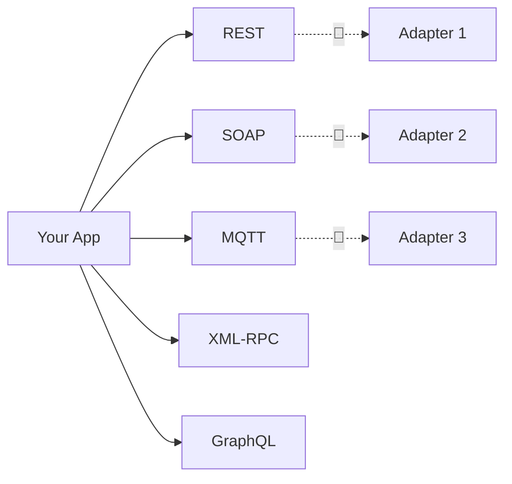

# The £330M API Meltdown

💥

**A single API contract change that broke an entire bank**

<v-click>

*"In 2018, TSB Bank pushed a system migration that broke API compatibility overnight — locking millions of customers out of their accounts and costing over £330 million."*

</v-click>

<!-- speaker:
“This… is the £330 million API meltdown.”
TSB Bank’s system migration in 2018 — they merged two backend systems, and an API schema mismatch brought the whole operation to its knees.
Customers were locked out for weeks, and the cost ballooned into the hundreds of millions.
Tone: a single mismatch in data contracts can cascade across an entire enterprise.
Transition: “But it’s not just banks…”
-->

---
layout: center
class: text-center
---

# The $1.1T Rally Outage

📉

**When Robinhood’s backend failed during a $1.1 trillion market surge**

<v-click>

*"Millions of traders were locked out on one of the biggest trading days in history — all due to a backend integration failure."*

</v-click>

<!-- speaker:
“This one hurts a little more personally…”
In March 2020, Robinhood’s trading API dependencies and load balancers failed right as markets rallied after a historic drop — during what analysts called a $1.1 trillion recovery day.
Developers later cited a chain of overloaded services and integration points that weren’t ready for the surge.
Transition: “Different industry, same story — fragile glue holding everything together.”
-->

---
layout: center
class: text-center
---

# The Internet Is Held Together By Glue and Good Intentions

<v-click>

**Every integration, webhook, and “just one more endpoint” adds a new weak link.**

</v-click>

<v-click>

> “The modern Internet runs on invisible handshake agreements between APIs that rarely read the same dictionary.”

</v-click>

<!-- speaker:
Every major system we rely on — payments, logistics, social, authentication — is powered by inter-API cooperation.
-->

---
layout: statement
---

# APIs Are Like Power Outlets

<v-click>

*They all deliver electricity — but every country has its own plug shape, voltage, and socket standard.*

</v-click>

<v-click>

*To connect safely, you need the right adapter — or things blow up.*

</v-click>

---
layout: two-cols
layoutClass: gap-16
---

# Crossing Borders, Crossing APIs

  

    🌍 **Every partner speaks a different protocol:** REST, SOAP, MQTT, GraphQL, XML-RPC...
  

  

    ⚙️ **Every schema tells a different story:** What’s `orderId` here might be `shipment_ref` there.
  

  

    🔌 **Every integration needs an adapter:** Mapping, transformation, and retries.
  

  

    🧩 **That’s where Cloudflare Workers come in.**
  

::right::

<!--
Visual metaphor of “outlets and adapters” leading naturally into your solution layer.
-->

---
layout: center
class: text-center
---

# What if every API spoke the same language?

<v-click>

## …and your app didn’t need to carry 47 adapters in its backpack?

</v-click>

<v-click>

Let’s talk about how Cloudflare Workers can make that happen.

</v-click>

<!--
Bridges cleanly into the technical story (single Worker translator).
-->
